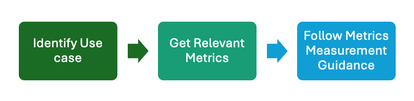

# 🔍 PQBench – Post-Quantum Cryptography Benchmarking Tool 

**PQBench** offers a curated collection of cryptographic use cases, each mapped to relevant evaluation metrics tailored for Post-Quantum Cryptography (PQC). Designed for security architects, cryptography researchers, and system designers, it supports a structured and practical approach to assessing cryptographic systems during and after migration.

It provides:
- A categorized list of cryptographic use cases.
- Mappings between use cases and appropriate evaluation metrics.
- Practical guidance on selecting metrics based on deployment context.
- Step-by-step instructions for measuring system performance during migration.

---
## 🧭 How to Use

1. **Step 1 - [Identify Use-case](./Use-Case-Categories.md):** Identify the environment or application usecases where the cryptographic system will be deployed.
2. **Step 2 - [Identify Applicable Metrics](./Categories-vs-Metrics.md):** Use the provided mapping to determine which performance metrics are most applicable.
3. **Step 3 - [Measure Metrics](./Performance-Metrics.md):** Refer to the metric definitions, measurement techniques, and recommended tools.
This step-by-step approach ensures your evaluation is focused, measurable, and aligned with real-world deployment needs.

---
<!-- ## 🎯 Purpose & Audience

The goal of these metrics is to offer practical, actionable guidance for evaluating the performance of cryptographic systems. This includes assessing aspects such as:
- Network Throughput & Latency
- Resource consumption (CPU, memory) etc.

This resource is intended for:
- Security Architects & Engineers  
- Cryptography Researchers  
- System Designers  

--- -->

